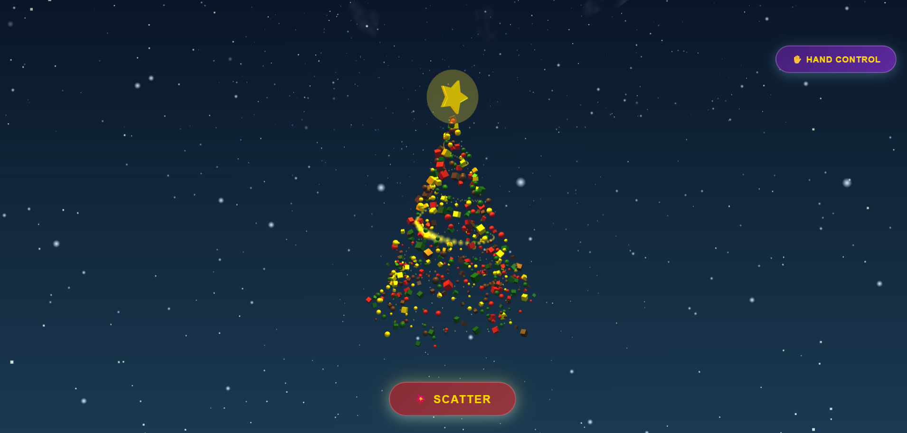

# 🎄 Magic Christmas Tree

An interactive 3D Christmas tree visualization with hand gesture controls, powered by Three.js, GSAP, and MediaPipe.



## ✨ Features

- **Interactive Christmas Tree**: 500+ animated ornaments that can gather into a tree or scatter into space
- **Hand Gesture Control**: Control the tree with hand gestures using your webcam
  - ✊ **Fist** → Gather ornaments into tree formation
  - 🖐️ **Open Hand** → Scatter ornaments into space
- **Stunning Visual Effects**:
  - Aurora borealis sky dome with animated colors
  - 2000+ twinkling stars
  - Shooting stars
  - Drifting clouds
  - 700 falling snowflakes with hand interaction
  - Golden spiral ribbon
  - Dynamic lighting system
  - Star dust particles

## 🚀 Quick Start

1. Open `index.html` in a modern web browser (Chrome, Firefox, Edge, Safari)
2. The tree will load in scattered state
3. Click **"🎄 Gather"** to form the Christmas tree
4. Click **"💥 Scatter"** to disperse into chaos
5. Click **"✋ Hand Control"** to enable gesture controls (requires webcam access)

## 📁 Project Structure

```
magic-christmas-tree/
├── index.html              # Main HTML file
├── css/                    # Stylesheets
│   ├── main.css           # Base styles
│   ├── controls.css       # Button styles
│   └── hand-tracking.css  # Hand tracking UI
├── js/                     # JavaScript modules
│   ├── config.js          # Configuration
│   ├── main.js            # Main orchestrator
│   ├── scene/             # Scene setup
│   ├── entities/          # 3D entities
│   ├── animations/        # Animation logic
│   ├── interactions/      # Hand tracking
│   └── utils/             # Utility functions
├── assets/                 # Project assets
│   └── image.png          # Preview screenshot
└── README.md              # Documentation
```

## 🛠️ Technologies

- **[Three.js](https://threejs.org/)**: 3D graphics library
- **[GSAP](https://greensock.com/gsap/)**: Animation library
- **[MediaPipe Hands](https://google.github.io/mediapipe/solutions/hands)**: Hand tracking ML model
- **ES6 Modules**: Modern JavaScript architecture
- **WebGL**: Hardware-accelerated rendering

## 🎮 Controls

### Mouse Controls
- **Left Click + Drag**: Rotate view
- **Right Click + Drag**: Pan view
- **Scroll Wheel**: Zoom in/out
- **Auto-Rotate**: Scene rotates automatically

### Button Controls
- **🎄 Gather**: Form the Christmas tree
- **💥 Scatter**: Disperse into space
- **✋ Hand Control**: Toggle gesture recognition

### Hand Gesture Controls
- **✊ Fist**: Gather ornaments + create snow spiral effect
- **🖐️ Open Hand**: Scatter ornaments + create snow wave effect

## 📝 Configuration

Edit `js/config.js` to customize:

```javascript
export const CONFIG = {
    ornamentCount: 400,      // Number of ornaments
    starDustCount: 1000,     // Number of star particles
    snowCount: 700,          // Number of snowflakes
    treeHeight: 20,          // Tree height
    treeBaseRadius: 8,       // Tree base radius
    scatterRadius: 50,       // Scatter sphere radius
    animationDuration: 1.8,  // Animation duration (seconds)
    colors: { ... },         // Color palette
    handTracking: { ... }    // Hand tracking settings
};
```

## 🎨 Customization

See [PROJECT_MAP.md](PROJECT_MAP.md) for detailed guidance on:
- Changing visual appearance
- Modifying animations
- Adding new features
- Adjusting physics
- Customizing interactions

## 📚 Documentation

- **[REFACTORING_SUMMARY.md](REFACTORING_SUMMARY.md)**: Detailed refactoring notes
- **[PROJECT_MAP.md](PROJECT_MAP.md)**: Navigation guide for developers
- **JSDoc comments**: In-code documentation for all functions

## 🔧 Development

### File Organization
- **CSS files**: Organized by feature (main, controls, hand-tracking)
- **JS modules**: Organized by responsibility (scene, entities, animations, interactions, utils)
- **Module exports**: Named exports for better tree-shaking
- **Dependencies**: Clear dependency injection patterns

### Adding New Features
1. Create new module in appropriate folder
2. Add JSDoc documentation
3. Export functions/classes
4. Import in `main.js`
5. Initialize in `init()` or use in `animate()`

## 🌟 Performance

- Optimized geometry with appropriate detail levels
- Efficient particle systems
- Hardware-accelerated WebGL rendering
- Smooth 60 FPS animations
- Responsive to window resize
- ~2,700 lines of well-organized code

## 🎅 Credits

- **Three.js Team**: 3D graphics engine
- **GreenSock (GSAP)**: Animation library
- **Google MediaPipe**: Hand tracking ML model
- **Original Creator**: Single-file implementation
- **Refactored by**: AI Assistant (Claude Sonnet 4.5)

## 📜 License

This project is for educational and demonstration purposes.

## 🎄 Merry Christmas!

Enjoy the magic of an interactive Christmas tree with stunning visual effects and innovative hand gesture controls!

---

Made with ❤️ and ✨ using Three.js, GSAP, and MediaPipe
